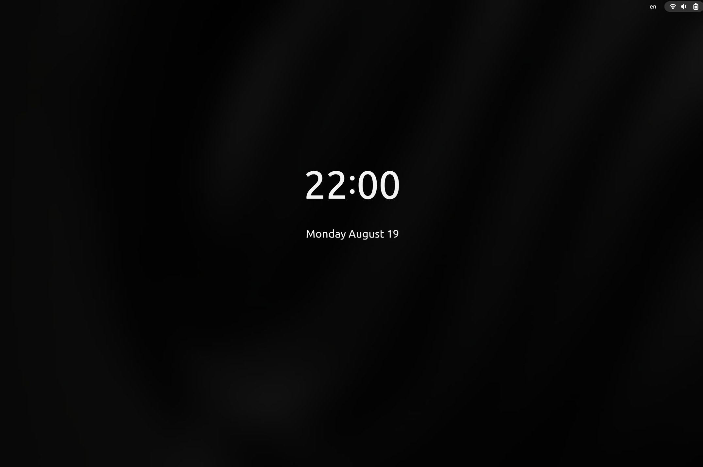

<h1 align="center"> Lumos
<p>
<p align="center"> 

## 📖 What's it?
Script to prevent lock screen from fading for GNOME Shell

## ⚙️ Usage
Clone the repo and go to the project folder:
```sh
git clone https://github.com/sotchenkov/lumos.git
cd ./lumos
```

You can run the script in foreground by running the command:
```sh
./lumos
```
and in the background by running
```sh
./lumos -b
```

To stop the script running in the background, run the command:
```sh
./lumos -s
```

## 🤖 Autostart
To run the script with the system, run the command
```sh
./add-to-startup
```
And, accordingly, to remove from autorun:
```sh
./remove-from-startup
```

## ✅ Test
Tested on Ubuntu 24.04 + Wayland + GNOME 46
